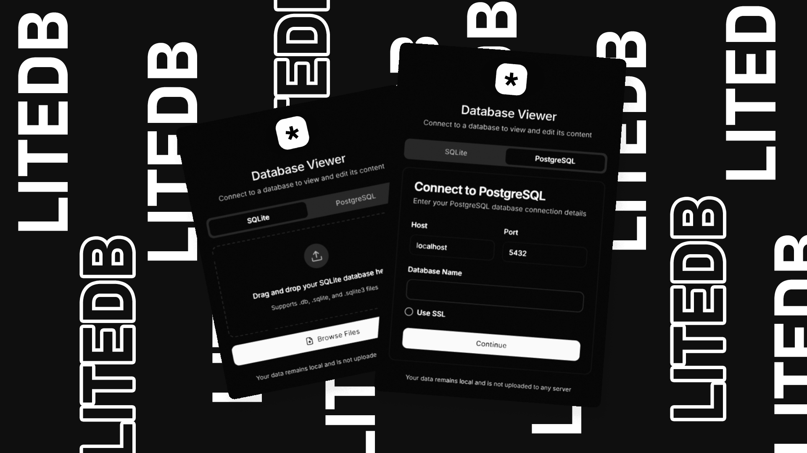

# LiteDB

A modern, fast, and user-friendly database viewer/editor built with React and Tauri (Rust). Now supporting both SQLite and PostgreSQL with seamless database management and advanced vector search capabilities.

<div align="center">

[](https://github.com/createdbyadham/LiteDB/releases/tag/v2.1.0)
[](https://www.linkedin.com/feed/update/urn:li:activity:7377312579544563712/?updateEntityUrn=urn%3Ali%3Afs_feedUpdate%3A%28V2%2Curn%3Ali%3Aactivity%3A7377312579544563712%29)

</div>



## Measured, not asserted

LiteDB's Text-to-SQL agent ships with a public benchmark in [`evals/`](./evals)
— 109 cases scored by **execution accuracy**, with a held-out split that was
written after the prompt work and never tuned against.

`qwen2.5-coder:7b` running locally on a 6 GB laptop GPU, SQLite:

| | Overall | Held-out |
| --- | ---: | ---: |
| Schema context + execution-guided repair | 77.3% | 67.6% |
| \+ retrieved few-shot exemplars | **85.6%** | **76.5%** |

On a **second, unseen schema** — different naming conventions, integer cents,
nullable dates — the same agent scores 91.7%, so the gains are not an artifact
of one database.

```bash
npm run eval:selftest   # verify the harness itself (no API calls)
npm run eval -- --provider ollama
```

Six experiments are documented in [`evals/README.md`](./evals/README.md),
including the two that were **rejected** and the case-design defects a stronger
model exposed. Every number is reproducible with one command.

## Features

- **Schema Visualization**: Visualize your database structure, relationships, and foreign keys in an interactive diagram.
  - **Auto-Layout**: Automatically arranges tables to minimize crossing lines.
  - **Export**: Save your schema diagram as **PNG or SVG** for documentation.
- **Edit Support**: View and edit database records directly
- **Advanced Search**: Filter and search through your data
- **Real-time Updates**: Changes reflect immediately
- **Data Sorting**: Sort any column with a click
- **Responsive Design**: Works great on any screen size
- **Batch Operations**: Execute multiple SQL statements with transaction support
- **SQL Script Management**: Save and reuse your SQL scripts
- **Dual Database Support**: Works with SQLite and PostgreSQL
- **AI Agent (Text-to-SQL)**: Turn natural language into SQL queries.
  - **Privacy-First AI**: 100% Local Text-to-SQL support with Ollama.
  - Supports OpenAI, GitHub, and Azure providers.
  - Schema is injected into the LLM upon initialization and refresh.
- **Autosave & Export**: Automatically save changes and export query results to **CSV, Excel, or JSON**.
- **Vector Search & Semantic Search**: Perform semantic similarity searches on your data using pgvector and local embedding models.

## Schema Visualization

LiteDB now includes a powerful **Entity Relationship Diagram (ERD)** generator:
1. **Interactive Graph**: Drag and drop tables, zoom in/out, and explore relationships.
2. **Visual Foreign Keys**: Lines connect Foreign Keys (Source) to Primary Keys (Target) automatically.
3. **Key Indicators**: Visual icons for Primary Keys (🔑), Foreign Keys (🔗), and Unique constraints (#).
4. **Export Ready**: One-click export to high-quality images for your technical documentation.

## Vector Search & Semantic Search

LiteDB integrates advanced vector search capabilities powered by **pgvector** and local embedding models:

1.  **Semantic Search**: Find similar rows based on vector embeddings.
    *   **Search by Row ID**: Find rows that are semantically similar to a specific record.
    *   **Search by Text**: Enter natural language queries to find relevant records using local embedding models.
2.  **Local Embedding Models**: Run embedding models locally in your browser/app using Transformers.js.
    *   Supported models: `all-MiniLM-L6-v2`, `bge-base-en-v1.5`, `bge-large-en-v1.5`.
    *   Privacy-first: No data is sent to external APIs for embedding generation.
3.  **Distance Metrics**: Support for multiple distance metrics to suit your data:
    *   **Cosine Distance** (`<=>`): Best for normalized vectors.
    *   **L2 Distance** (`<->`): Euclidean distance.
    *   **Inner Product** (`<#>`): Dot product (negative).
4.  **Visual Feedback**: Color-coded similarity bars to quickly identify the most relevant results.

## AI Architecture (Text-to-SQL)

Unlike standard API wrappers, LiteDB implements a **Context-Aware RAG Pipeline** to ensure high-accuracy SQL generation:

1.  **Schema Extraction**: On connection, the app actively introspects the database to extract table definitions, foreign keys, and data types.
2.  **Dynamic Context Injection**: This metadata is formatted and injected into the LLM's system prompt (System Message), giving the model "awareness" of the specific database structure.
3.  **Driver-Specific Validation**: The system prompts are tailored to the active driver (e.g., enforcing PostgreSQL specific syntax vs. SQLite), reducing syntax errors in generated queries.

### Measured accuracy

Accuracy claims about the Text-to-SQL agent are backed by a public, runnable
benchmark in [`evals/`](./evals) rather than asserted. It scores **execution
accuracy** — the generated query and a reference query are both executed
against a seeded fixture database and their result sets compared — so any
correct formulation counts, not just one that matches a string.

```bash
npm run eval:selftest              # verify the harness itself (no API calls)
npm run eval:verify                # verify the golden set (no API calls)
npm run eval -- --provider ollama  # score a local model
```

109 cases across five slices (`single-table`, `joins`, `aggregation`,
`window-functions`, `ambiguous-schema`), over two fixture schemas, runnable against SQLite or PostgreSQL
and any of the four supported providers. Failures are typed — a query that
answers the wrong question is reported separately from one that fails to parse,
and provider outages are excluded from the score entirely.

The harness executes model-generated SQL, so it treats that SQL as hostile:
a static read-only guard, plus an engine that physically cannot write
(read-only SQLite connection; `BEGIN READ ONLY` in Postgres).

See [`evals/README.md`](./evals/README.md) for the methodology, the comparison
rules and their tradeoffs, and how to add cases.

## Tech Stack

- React
- TypeScript
- Vite
- Tailwind CSS
- Tauri (Rust)
- PostgreSQL
- SQLite

## Getting Started

### Prerequisites

- Node.js (v16 or higher)
- Rust (latest stable)
- PostgreSQL (if using PostgreSQL features)

### Installation

1. Clone the repository:
```bash
git clone https://github.com/createdbyadham/LiteDB
```

2. Install dependencies:
```bash
npm install
```

3. Start the development server:
```bash
npm run tauri dev
```

### Building for Production

```bash
npm run tauri build
```

## Usage

Connecting to Databases:
1. SQLite: Click "Upload Database" or drag & drop your SQLite file
2. PostgreSQL: Open the Connection Manager, enter your credentials, and connect
3. Switch Databases: Use the database switcher to toggle between SQLite & PostgreSQL
4. Browse tables using the table selector
5. Use the search bar to filter data
6. Double-click any row to edit
7. Check multiple rows at once then click "Delete" to remove them
8. Click "Save Changes" to persist modifications

PostgreSQL-Specific Features:
- Run SQL queries with real-time feedback
- View table structures directly in the UI
- Batch execute multiple statements in transaction mode
- Securely connect using SSL

### Batch Operations & SQL Scripting

The batch operations feature allows you to execute multiple SQL statements at once, which is perfect for complex database operations.

#### Using Batch Operations

1. After loading a database, click on the "Batch Operations" tab
2. Enter your SQL statements in the editor, separating them with semicolons (`;`)
3. Use the "Use Transaction" toggle to enable/disable transaction mode:
   - When enabled (default): All statements succeed or none do (atomic operations)
   - When disabled: Each statement is executed independently
4. Click "Execute Script" to run your SQL commands
5. View the results including execution time, affected tables, and any errors

#### Saving and Reusing Scripts

1. Write your SQL script in the editor
2. Enter a name for your script in the input field
3. Click "Save Script" to store it for future use
4. Access your saved scripts by clicking on the "Saved Scripts" tab
5. Use the "Load" button to load a script back into the editor
6. Delete unwanted scripts with the delete button

#### Example Scripts

Here are some example SQL scripts you can try:

**Create new table and insert data:**
```sql
CREATE TABLE users (
  id INTEGER PRIMARY KEY,
  name TEXT NOT NULL,
  email TEXT,
  age INTEGER
);

INSERT INTO users (id, name, email, age) VALUES (1, 'name-example1', 'name1@example.com', 32);
INSERT INTO users (id, name, email, age) VALUES (2, 'name-example2', 'name2@example.com', 28);
```

**Update and delete records:**
```sql
UPDATE users SET age = 33 WHERE name = 'John Doe';
DELETE FROM users WHERE name = 'Jane Smith';
```

**Schema modifications:**
```sql
ALTER TABLE users ADD COLUMN created_at TEXT;
UPDATE users SET created_at = datetime('now');
CREATE INDEX idx_users_name ON users (name);
```

**Complex operations with transaction:**
```sql
BEGIN TRANSACTION;
CREATE TABLE temp_users AS SELECT * FROM users;
UPDATE users SET age = age + 1;
INSERT INTO users SELECT * FROM temp_users WHERE age > 30;
DROP TABLE temp_users;
COMMIT;
```

## Development

### Project Structure

```
src/
  ├── components/     # React components
  ├── hooks/         # Custom React hooks
  ├── lib/           # Utilities and services
  ├── styles/        # Global styles
  └── types/         # TypeScript type definitions
```

### Contributing

1. Fork the repository
2. Create your feature branch (`git checkout -b feature/amazing-feature`)
3. Commit your changes (`git commit -m 'Add some amazing feature'`)
4. Push to the branch (`git push origin feature/amazing-feature`)
5. Open a Pull Request

## License

This project is licensed under the MIT License - see the [LICENSE](LICENSE) file for details.
